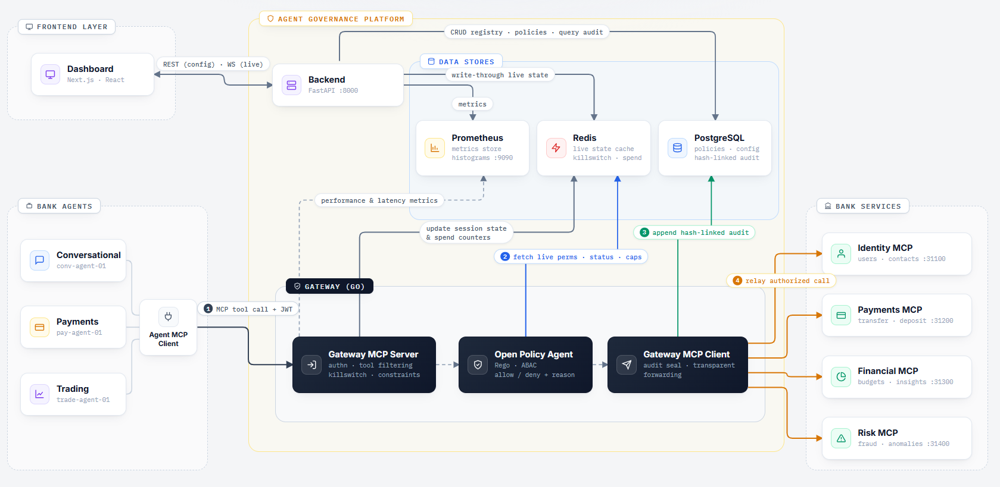

# Reflex — Governance Layer for Financial AI Agents

[](https://golang.org)
[](https://nextjs.org)
[](https://fastapi.tiangolo.com)
[](https://postgresql.org)
[](https://redis.io)
[](https://openpolicyagent.org)
[](LICENSE)

**Reflex** is an enterprise-grade **In-Flight Security Interceptor & Transparent Reverse Proxy** for autonomous AI agents operating in financial services and high-compliance enterprise environments.

It provides real-time governance infrastructure that empowers financial institutions to deploy fleets of autonomous AI agents safely—enforcing granular attribute-based tool permissions (ABAC), sub-millisecond killswitches, atomic dynamic spend limits, real-time rate limiting, embedded OPA policy evaluation, and tamper-evident SHA-256 cryptographic audit trails.

---

## 🏛️ System Architecture

Reflex sits transparently between autonomous AI Agents (LangChain, CrewAI, AutoGen, VS Code Copilot, Claude Desktop) and high-value Downstream Banking APIs (Identity, Payments, Risk Ops):

<p align="center">
  
</p>

### End-to-End Governance Flow

1. **Agent Invocation**: AI agents submit standard **Model Context Protocol (MCP)** JSON-RPC requests (`tools/list` or `tools/call`) to the Gateway (`:8080`).
2. **In-Flight Security Gauntlet**:
   - **Revocation & Fleet Halt Check**: Immediate sub-millisecond validation against pipeline-cached Redis revocation keys.
   - **Embedded OPA Policy Engine**: Lock-free, in-memory Rego policy evaluation enforcing fine-grained ABAC rules.
   - **Atomic Spend Cap Engine**: Redis Lua scripts execute atomic per-parameter budget deductions and rate limits.
   - **Cryptographic Audit Ledger**: Computes tamper-evident SHA-256 chained hashes (`entry_hash = SHA-256(prev_hash || row_data)`) stored in PostgreSQL.
3. **Transparent Forwarding**: Approved requests are forwarded to target downstream Bank MCP servers (`bank-identity`, `bank-payments`, `bank-financial`, `bank-risk`).
4. **Control Plane & Instrumentation**: FastAPI backend coordinates policy compilation, OpenAPI virtual registration, and streams live telemetry over WebSockets to the Next.js Control Center UI.

---

## 🌟 Key Capabilities

- 🛡️ **In-Flight Multi-Stage Governance Gauntlet**: Evaluates every tool invocation attempt in real time across 5 safety stages before hitting core banking infrastructure.
- ⚡ **Sub-Millisecond Killswitch & Fleet Halt**: Instantly revoke individual agent instances or halt the entire agent fleet in `<1ms` via Redis pipelines.
- 🔍 **Dynamic Discovery Schema Filtering**: Filters `tools/list` output per agent profile to eliminate LLM hallucinations and prevent unauthorized tool access.
- 💰 **Atomic Spend Cap Engine**: Prevents race conditions and budget overshoots using atomic Redis Lua scripts enforcing per-parameter spending caps (per-call max, hourly, and daily) scoped to each tool's numeric fields.
- 📜 **Embedded OPA Rego Policy Engine**: Lock-free, in-memory Open Policy Agent evaluation with atomic hot-reloading driven by PostgreSQL changes.
- 🔒 **Tamper-Evident SHA-256 Audit Ledger**: Cryptographically chained audit ledger (`entry_hash = SHA-256(prev_hash || row_data)`) with an online audit verification engine.
- 📊 **Real-Time Instrumentation & Control Center**: Next.js 14 dark-mode management console with live WebSocket telemetry streams, visual policy builder, and latency percentiles (P50/P95/P99).
- 🔌 **OpenAPI Virtualization**: Dynamically convert legacy REST/OpenAPI specs into AI-accessible MCP tools on the fly.

---

## 📂 Platform Directory & Documentation Layout

Reflex is organized into modular, decoupled microservices:

| Directory                        | Tech Stack                                                | Description                                                                                                                                       | Sub-Readme Link                       |
| -------------------------------- | --------------------------------------------------------- | ------------------------------------------------------------------------------------------------------------------------------------------------- | ------------------------------------- |
| ⚡ [**`gateway/`**](./gateway)   | Go 1.26, OPA, Redis, PostgreSQL, Goose, sqlc              | High-throughput transparent reverse proxy, MCP interceptor, embedded OPA engine, per-parameter spend cap limiter, and cryptographic audit logger. | [Gateway Docs](./gateway/README.md)   |
| ⚙️ [**`backend/`**](./backend)   | Python 3.12, FastAPI, Pydantic, SQLAlchemy, Redis Pub/Sub | Control Plane API, Rego policy compiler, agent lifecycle manager, OpenAPI virtualizer, and event publisher.                                       | [Backend Docs](./backend/README.md)   |
| 🌐 [**`frontend/`**](./frontend) | Next.js 14, React 18, Tailwind CSS, Lucide Icons          | Operator dashboard featuring live fleet monitor, visual rule builder, audit verification, and performance instrumentation.                        | [Frontend Docs](./frontend/README.md) |
| 📜 [**`scripts/`**](./scripts)   | Python 3.12, Asyncio, HTTPX                               | Seed scripts and real-time multi-agent load simulation suite testing all governance gauntlet features.                                            | —                                     |
| 📁 [**`docs/`**](./docs)         | System architecture diagram                               | —                                                                                                                                                 | —                                     |
| 🗄️ [**`db/`**](./db)             | PostgreSQL 16, Goose Migrations                           | Database schema migrations (`001_schema.sql`, `002_seed.sql`) for agent entities, policies, and audit logs.                                       | —                                     |

---

## 🚀 Quick Start

### 1. Prerequisites

- **Docker** & **Docker Compose**
- **Go 1.26+** and **Python 3.12+** (optional for standalone local development)

### 2. Launch the Full Reflex Platform Stack

```bash
# Clone the repository
git clone https://github.com/prajwalmandlecha/Reflex.git
cd Reflex

# Build and launch all services via Docker Compose
docker compose up -d --build
```

### 3. Verify Running Services

| Component                            | URL                             | Port   |
| ------------------------------------ | ------------------------------- | ------ |
| 🌐 **Reflex Control Center UI**      | `http://localhost:3000`         | `3000` |
| ⚡ **Reflex Gateway Proxy**          | `http://localhost:8080`         | `8080` |
| ⚙️ **Backend Control Plane API**     | `http://localhost:8000`         | `8000` |
| 📊 **Prometheus Metrics Exposition** | `http://localhost:9090/metrics` | `9090` |
| 🗄️ **PostgreSQL 16 Database**        | `localhost:5433`                | `5433` |
| 🔑 **Redis 7.2 Cache & Pub/Sub**     | `localhost:6379`                | `6379` |

---
